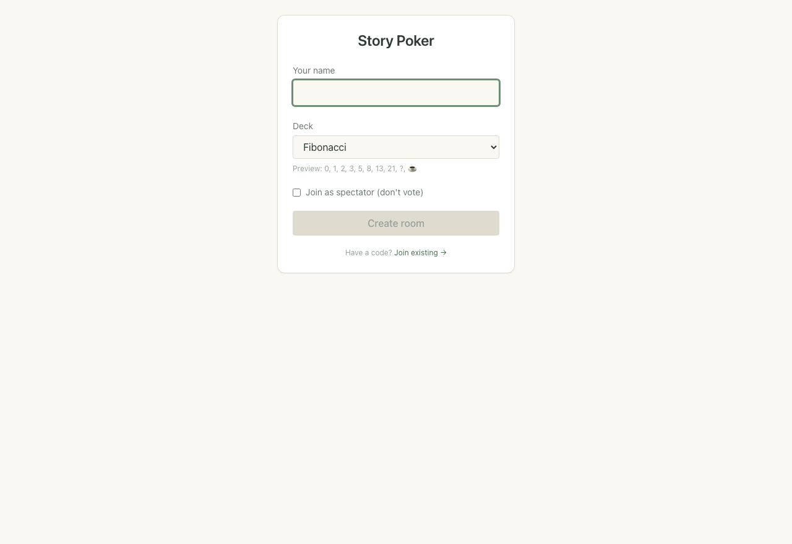
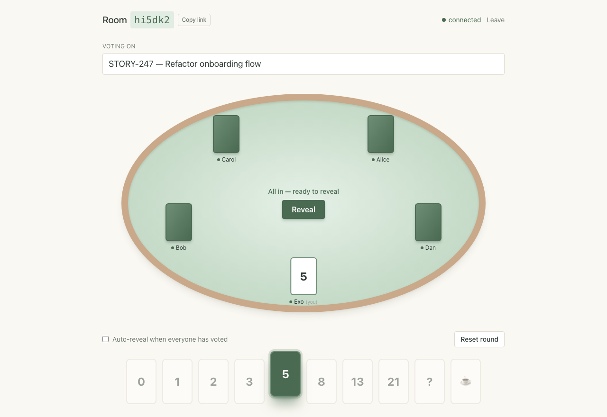
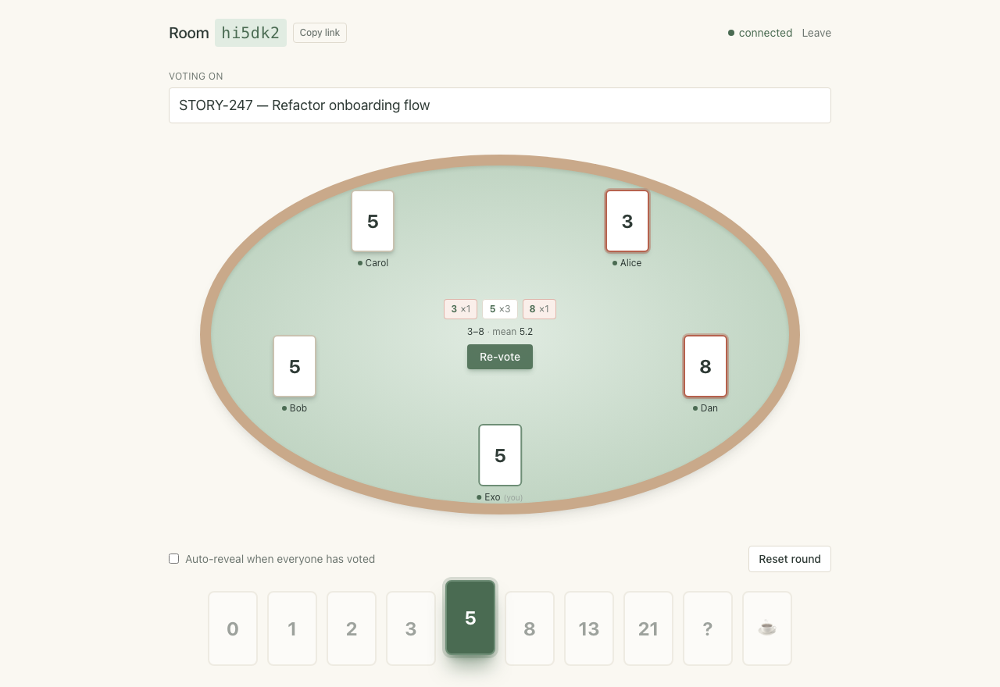

# Story Poker

A real-time planning poker tool. Make a room, share the link, vote on a story, flip the cards together.

**Live:** [storypoker.exomercado.dev](https://storypoker.exomercado.dev)

Made for small teams that want quick story estimating — no accounts, no database, nothing in the way.

## Screenshots

| Entry | Mid-round | Revealed |
|---|---|---|
|  |  |  |

## Features

- **Live updates** — votes show up instantly; everyone sees the reveal at the same time
- **3-second countdown before reveal** so people have a beat to look up
- **Stays connected through hiccups** — close your laptop, open it back up, your vote and seat are still there
- **Pick a deck** — Fibonacci, T-shirt sizes, powers of 2, or your own
- **Spectator mode** for people who want to watch without voting
- **Auto-reveal** once everyone has voted (optional)
- **Re-vote** without losing the story, or **reset** to start over
- **Session history** — see past rounds while the room is open
- **Outlier highlight** after reveal so you spot who's way high or way low
- **Works on phones**, with a calm sage-and-cream light theme

## Stack

- **Backend:** Go with [`coder/websocket`](https://github.com/coder/websocket)
- **Frontend:** React 19 + Vite + TypeScript + Tailwind v4
- **Animations:** [motion](https://motion.dev) for the card flip and other touches
- **No database** — rooms live in the server's memory and are cleared when empty. Restart the server and everyone joins fresh.

## Quick start

Run the whole thing locally with one command. Edits show up live in the browser.

```sh
make dev
```

Open `http://localhost:5173`.

Common commands (`make help` lists all):

```
make dev         start the app with hot reload
make logs        tail both services
make restart     restart both services
make lint        gofmt + go vet + eslint
make typecheck   tsc + go vet
make test        go test ./...
make down        stop everything
make clean       stop and wipe volumes
```

### Without Docker

```sh
# terminal 1 — backend
cd server
ALLOW_ALL_ORIGINS=1 go run .

# terminal 2 — frontend
cd web
BACKEND_PORT=8080 npm run dev
```

## Project structure

```
.
├── server/                 Go backend
│   ├── main.go               HTTP server, WebSocket handlers
│   ├── hub.go                connection registry, broadcast, grace timers
│   ├── room.go               participant state, voting, reveal logic
│   ├── protocol.go           wire types (shared shape with the client)
│   └── Dockerfile.dev        dev container (air for hot reload)
├── web/                    React frontend
│   ├── src/
│   │   ├── App.tsx              routes between entry / name modal / room
│   │   ├── useRoom.ts           WebSocket hook with reconnection
│   │   ├── protocol.ts          wire types mirroring the server
│   │   ├── voteAnalysis.ts      outlier computation
│   │   └── components/
│   │       ├── EntryScreen.tsx     create-or-join landing
│   │       ├── NamePromptModal.tsx URL-share auto-join modal
│   │       ├── RoomScreen.tsx      room shell + deck + spread + history
│   │       ├── Table.tsx           oval table layout + participant cards
│   │       ├── FlightCard.tsx      ghost card flying from deck to your seat
│   │       └── ConsensusBurst.tsx  sage particle celebration on consensus
│   └── vercel.json           Vercel build config
├── docker-compose.yml      dev environment (server + web)
├── Makefile                one-line dev / lint / build commands
└── CLAUDE.md               original build plan (kept as project north star)
```

## License

[MIT](LICENSE) — fork, use, change, sell, do whatever. Just keep the copyright notice in your copies.
